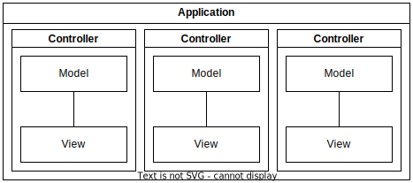

# Esse

###### MVC in PHP

### Features

* MVC Architecture
* Supports MariaDB and SQLite
* Simple Authentication
* All licenses are MIT at the time of writing (Dec. 2022)

### What

This is a PHP PSR-4 Framework - [www.php-fig.org/psr/psr-4/](https://www.php-fig.org/psr/psr-4/)

### Why

To craft PHP applications you need this style of Framework

This is a **M**odel-**V**iew-**C**ontroller Application in PHP

It:
* Creates an entry point
* Loads php scripts as required
* Calls a Controller
   * Models data
   * Displays a View



### How

1. Create a composer file

```json
{
  "license": "MIT",
  "minimum-stability": "dev",
  "autoload": {
    "psr-4": {
      "": "src/app"
    }
  },
  "require": {
    "bravedave/esse": "dev-main"
  }
}
```

2. update to install files

```bash
composer u
```

3. install a sample application

```bash
mkdir src
cp -r vendor/bravedave/esse/src/app src/app
cp -r vendor/bravedave/esse/www .
```

4. Run

```
cd www
php -S localhost:8080 _mvp.php
```

the program will run, but there are no users or database

* a data folder was created in src/data
  1. rename the esse-defaults-sample.json to esse-defaults.json <em>- activates SQLite as the database</em>
  2. create a user in users with a password
  3. logoff
  4. authentication is now required

dive into the app folder and build your app ! etc .. etc..

### Credits:

* [Bootstrap](https://getbootstrap.com)
* [JQuery](https://jquery.com)
* [Monolog](https://seldaek.github.io/monolog/)
* [Matthias Mullie minify and scrapbook](https://github.com/matthiasmullie)
* [Symfony Mailer](https://github.com/symfony/mailer)
* [Parsedown](https://parsedown.org/)
* and whatever libraries these libraries required
